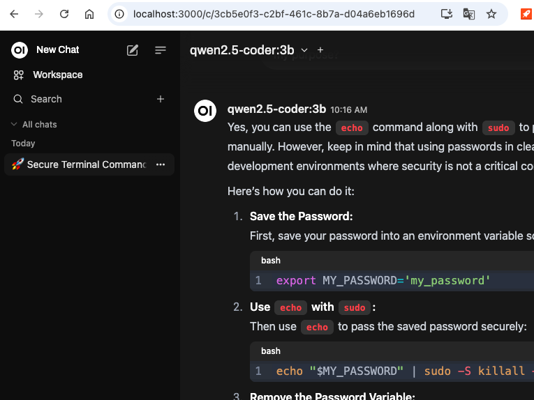

Tests were conducted with a 12 years old Macbook Air 2012 with 16G RAM laptop without GPU resource. It works like a charm.

### Side by side Open-WebUI Installation Guide
(Non-tech guys will be beneficial from this guide.)

If you are a lucky fellow, it is pretty smooth to lanuch it on your local machine according to offical installation guide, which only needs 2 lines of command.

However, you probablly need to go thru what I did if you are not the lucky guy like me meeting endless errors. Please continue reading.

## How to Install without Troubles (for Mac)
Updated on 9 Nov, 2024

### Clean up Python

1. Force quit all Python activities in your Activity Monitor
2. Throw away all your python(s) discovered in Finder-->Applications; don't hesitate to provide your password when asked

--Open your Terminal & run--

3. Find out Python stump
   ```bash
   ls /Library/Frameworks/Python.framework/Versions/
   ```
4. Delete Python stump
   ```bash
   sudo rm -rf /Library/Frameworks/Python.framework/Versions/3.13
   ```
   Repeat this deletion for specific Python versions listed in 3
5. Continue deleting
   ```bash
   rm -rf /Applications/Python
   rm -rf /Library/Frameworks/Python.framework
   rm -rf /usr/local/bin/python
   ```
6. Install Brew
   ```bash
   /bin/bash -c "$(curl -fsSL https://raw.githubusercontent.com/Homebrew/install/HEAD/install.sh)"
   ```
7. Delete using Brew
   ```bash
   brew doctor
   ```
8. Cleanup using Brew
   ```bash
   brew cleanup
   ```
9. Restart your computer


### Now Let's go for installation of Open WebUI
Open your terminal and run the following command to install Open WebUI:

1. Clone repo
   ```bash
   git clone https://github.com/open-webui/open-webui.git
   ```
2.  Install dependencies
   ```bash
   brew install python@3.11
   brew install cmake
   brew install libjpeg zlib
   brew install ffmpeg
   pip install --upgrade pip setuptools
   pip install -r backend/requirements.txt
   ```
3. Create environment
   #### Create an virtual environment for python 3.11
   ```bash
   python3.11 -m venv openwebui-env
   source openwebui-env/bin/activate
   pip install --upgrade pip setuptools
   ```
   #### Fix library version mismatch
   ```bash
   pip install -U cryptography
   brew reinstall openssl
   ```
   #### Set environment variables for Python linking to correct OpenSLL version
   ```bash
   export PATH="/usr/local/opt/openssl/bin:$PATH"
   export LDFLAGS="-L/usr/local/opt/openssl/lib"
   export CPPFLAGS="-I/usr/local/opt/openssl/include"
   ```
4. Install Open WebUI
   ```bash
   pip install open-webui
   ```

### Running Open WebUI
   After installation, you can start Open WebUI by executing:

   ```bash
   open-webui serve
   ```

This will start the Open WebUI server, which you can access at [http://localhost:8080](http://localhost:8080) or [http://0.0.0.0:8080/](http://0.0.0.0:8080/)


## How to Integrate openwebui and ollama in Docker (on Mac)
Updated on 13 Nov, 2024

### Make sure 1) access to python, github, brew, conda, huggingface....without issue (especially within Great Fucking Wall (GFW) governance; ignore if you are free from GFW), 2) your Docker is running (I am using OrbStack in this case)

### Create a project directory for open-webui
In your terminal - 
```bash
mkdir open-webui-docker
cd open-webui-docker
```
### Clone the open-webui repository
```bash
git clone https://github.com/open-webui/open-webui.git
cd open-webui
```
### Write a Dockerfile
```bash
nano Dockerfile
```
Add the following content to Dockerfile
```bash
# Use a lightweight Python base image
FROM python:3.11-slim

# Install essential system dependencies
RUN apt-get update && apt-get install -y \
    gcc \
    cmake \
    libjpeg-dev \
    zlib1g-dev \
    libssl-dev \
    libffi-dev && \
    rm -rf /var/lib/apt/lists/*

# Set working directory
WORKDIR /app

# Copy the project files into the container
COPY . /app

# Install Python dependencies
RUN pip install --no-cache-dir -r /app/backend/requirements.txt

# Set PYTHONPATH to include the backend directory
ENV PYTHONPATH-"/app/backend"

# Expose port 8000
EXPOSE 8000

# Run the server
CMD ["python", "-m", "/app/backend/open_webui/main.py"]
```
then save & exit
### Build image
```bash
docker build -t open-webui .
```
### Run container bundled with Open-WebUI and Ollama
```bash
docker run -d -p 3000:8080 \
  -v ollama:/root/.ollama \
  -v open-webui:/app/backend/data \
  --name open-webui \
  --restart always \
  -e HF_ENDPOINT=https://hf-mirror.com \
  ghcr.io/open-webui/open-webui:ollama
```
(here 'HF_ENDPOINT=https://hf-mirror.com' is for huminerals under GFW regime)
Your Open-WebUI and Ollama shall be run & up. Simply access via [http://localhost:3000](http://localhost:3000/).



### Tips
GGUF models

It is ok for smaller size models ie. <5G otherwise errors pop up. It seems it is an existing bug.
Also, make sure your ModelFile.txt placed in the same directory as the directory of other models downloaded directly from Open-WebUI interface.
Example of ModelFile:
```bash
model001_path=model001.gguf
model002_path=model002.gguf
...
```


